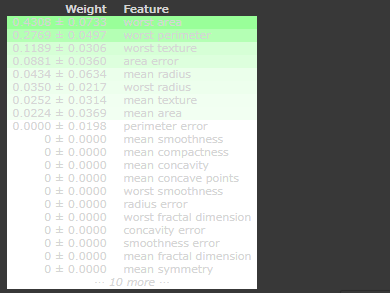
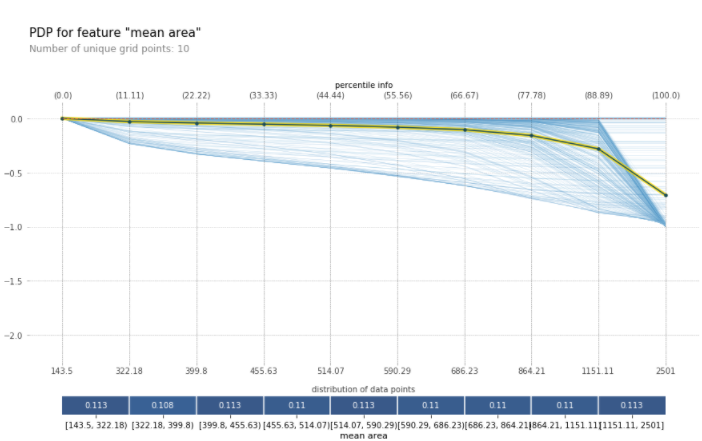
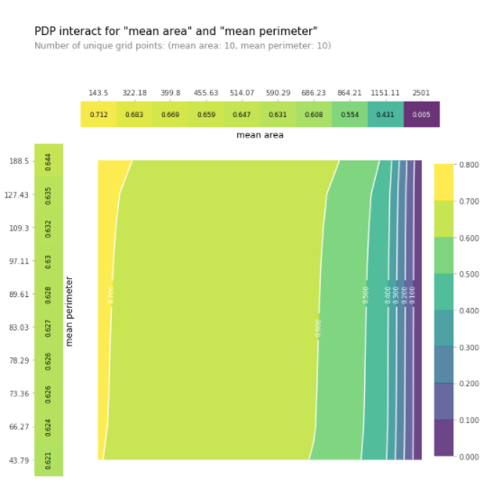
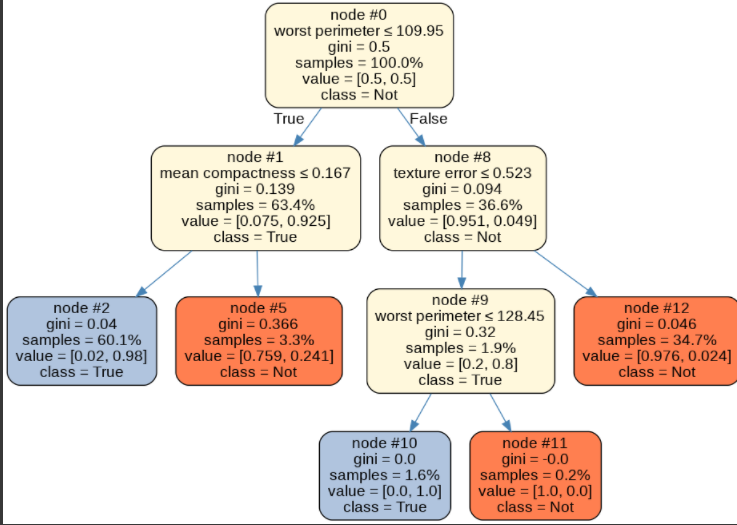

## 学習済みのモデルを使った大局説明
パッケージ:  
インストールについては各クラス定義されているdocument関数を参照すること  
+ eli5
+ pdpbox
+ Skater 

前提:   
事前分析ができており、ある程度の性能をもつモデルが作成できていること。  
テーブルデータであること。  
`sckit-learn`のモデルであること。  

### 可視化した際の例  

eli5による特量量毎の重要性を評価。訓練データと検証データを比較することでデータ間分布に開きがないか可視化できる。  
  

  
pdpboxによる特定の特長量における可視。モデルにおける目的変数への影響値を評価する。これを基にさらに深い分析が可能になる。  
  
  

  
Skaterによるモデルの簡略化。特にノードの少ない決定木により学習済モデルを再現することで人間にも理解しやすい条件分岐の様子を知ることができる。  
